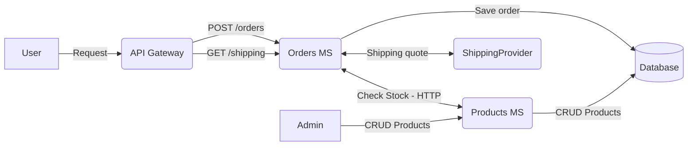
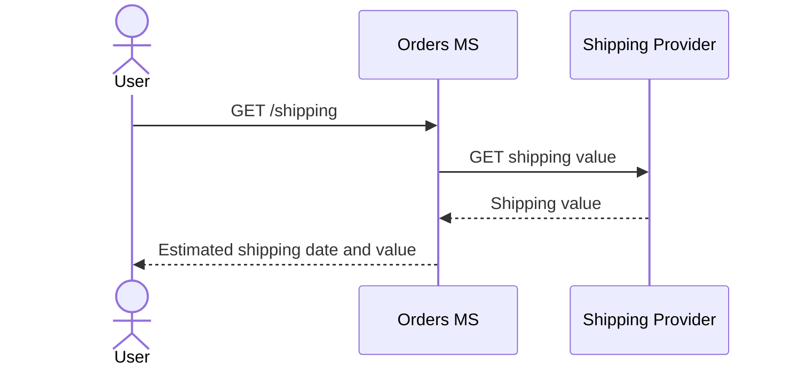
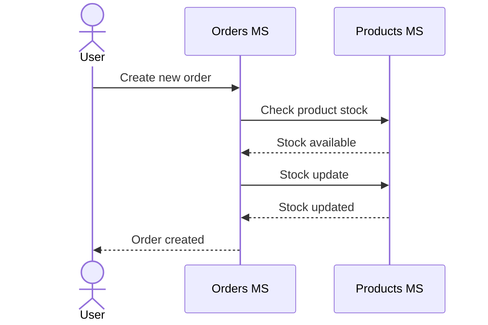

# OrdersMS <-> ProductsMS - System Design

## Instalation and Running project
You need to have Docker Compose already installed. On the root of the project (where we have docker-compose.yml) you should run this command:
```bash
    docker-compose up --build
```
The above command will create 3 containers:
- MySQL (With the default schema already created) -> PORT 3306
- Products MS -> http://localhost:3030
- Orders MS -> http://localhost:3000

## Swagger Documentation
To access the Swagger documentation it is necessary to run each MS and access the respective endpoints:
- Products MS -> http://localhost:3030/api-docs
- Orders MS -> http://localhost:3000/api-docs

## Architecture Design
Project architecture flow and entities



## Sequence Diagram
The project has 2 main sequence diagrams.The firt one for calculating shipping and the second one for creating an order

### Shipping quotation

### Order creation



